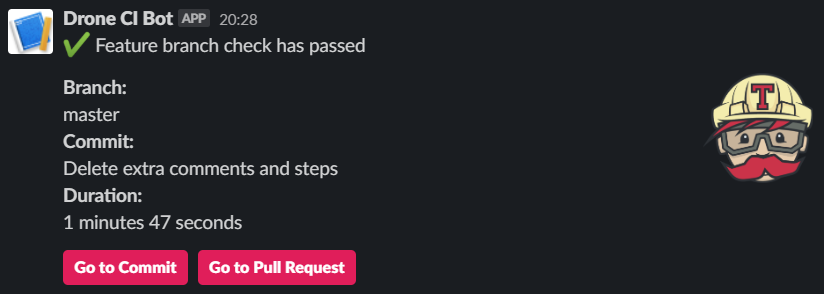
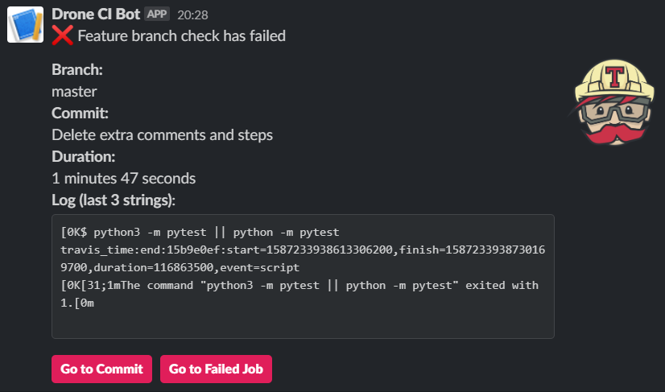

# Build Status Notifier

Bot for notifying developer in Slack about build execution status in Drone CI, Travis CI or Jenkins.

## Description

Bot guides each build from executing `git push` till its fully deployed.

Messages are sent to specified Slack channel. Each message contains useful information about build execution. Moreover, it is possible to redirect straight to commit, pull request or failed Travis job.

Planned as fully automated solution out-of-the-box. The only requirements is proper `config.json` file.

# Requirements

- python3.8+
- pip
- virtualenv (optional)

### Pip packages

To install required packages use one of commands below

#### Linux
Create `virtualenv`, enter it and install required packages.

```bash
python -m virtualenv env && source env/bin/activate
python -m pip install -r requirements.txt
```

#### Windows

```bash
python -m virtualenv env && source env/Scripts/activate
python -m pip install -r requirements.txt
```

## Usage

### Configuration

Create `config.json` in root directory using template below:

```JSON
{
    "slack": {
        "token": "slack_bot_token_unique_for_each_workspace",
        "bot_direct_messages_id": "channel_id"
    },
    "travis": {
        "token": "travis_api_token",
        "author": {
            "id": 12345,
            "login": "author"
        },
        "repositories": [
            {
                "id": 98765,
            }
        ],
        "request_frequency": 30
    }
}
```

### Run

To run bot use command `python bot.py` in root directory.
It will start monitoring for incoming messages.
When message is received, specified repositories are going to be monitored.

## Message examples

For now 2 types of messages are supported: feature branch check has passed and feature branch check has failed.

### Success



### Failure



## Demo


